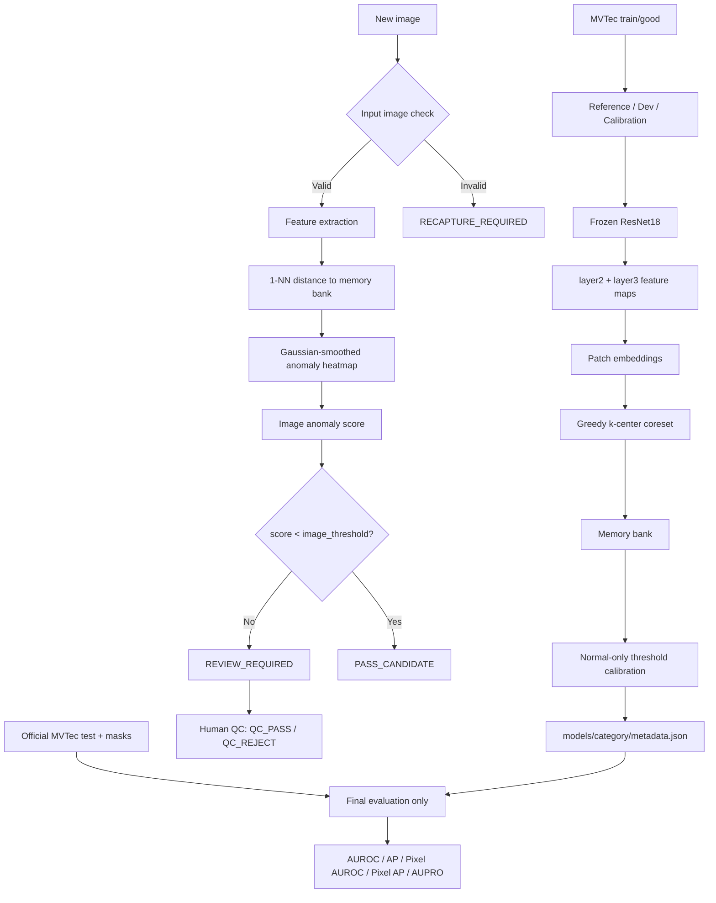

# MVTec AD — PatchCore-style Anomaly Detection

[](https://github.com/haminhthong/Mvtec-Anomaly-Detection/actions/workflows/ci.yml)
[](https://www.python.org/)
[](https://pytorch.org/)
[](https://fastapi.tiangolo.com/)
[](LICENSE)

Phát hiện bất thường ảnh công nghiệp theo hướng **one-class** trên [MVTec AD](https://www.mvtec.com/company/research/datasets/mvtec-ad). Model chỉ học từ ảnh `train/good`, dùng backbone ResNet18 pretrained bị đóng băng để tạo patch embedding, xây memory bank bằng greedy k-center coreset, sau đó dùng khoảng cách 1-NN để tạo image score và anomaly heatmap.

FastAPI chỉ là lớp demo serving cho pipeline CV. Ảnh có score cao được chuyển sang người kiểm tra; model không tự gán loại lỗi hoặc kết luận QC cuối cùng.

## Bài toán & phạm vi ứng dụng

MVTec AD cung cấp ảnh normal cho training, vì vậy one-class anomaly detection là formulation tự nhiên cho repo này. Phạm vi hiện tại:

- Mỗi lần chạy model cho một MVTec category, ví dụ `bottle`.
- Training chỉ đọc `train/good`; test và ground truth chỉ được đọc ở bước evaluation cuối.
- Tập normal được tách thành Reference, Dev và Calibration.
- Runtime decision chỉ có `PASS_CANDIDATE`, `REVIEW_REQUIRED` và `RECAPTURE_REQUIRED`.
- Không tự động thêm ảnh production vào memory bank; cập nhật reference phải là bước offline có kiểm soát.

## Luồng logic, data và pipeline

Đây là luồng duy nhất chi phối training, inference, evaluation và API:



### Verified benchmark: MVTec AD — bottle category only

Kết quả dưới đây là benchmark đã lưu cho category `bottle`; không suy ra cho 15 category.

| Metric | Result |
| --- | ---: |
| Image AUROC | 1.0000 |
| Image AP | 1.0000 |
| Pixel AUROC | 0.9818 |
| Pixel AP | 0.7157 |
| AUPRO@0.3 | 0.9410 |
| Test images | 83 (20 normal, 63 defect) |
| CPU latency | 145.7 ms/image* |

\* Latency là số đo lịch sử; hardware/thread provenance chưa đủ để coi là benchmark production. Chạy `scripts/benchmark_inference.py` để ghi lại CPU, nền tảng, PyTorch, thread count, P50/P95, throughput, RAM và kích thước memory bank.

## PatchCore-style là gì?

Các thành phần lấy cảm hứng từ PatchCore:

- frozen pretrained backbone;
- multi-layer patch embeddings từ `layer2` và `layer3`;
- normal memory bank;
- greedy k-center coreset;
- nearest-neighbor anomaly scoring;
- anomaly heatmap và Gaussian smoothing.

Repo này là **PatchCore-style implementation**, không tuyên bố reproduction nguyên bản 100% paper. Coreset hiện project patch về 64 chiều để chọn đại diện nhưng vẫn lưu feature runtime gốc 384 chiều của ResNet18. Image score là percentile của heatmap, còn image/pixel thresholds được tính từ normal calibration set.

## Visual examples

Một sample gồm Input, Ground Truth, Anomaly Map và Overlay:

| Good sample | Defect sample |
| --- | --- |
|  |  |

Tạo lại sau khi có data và model:

```bash
python scripts/generate_visual_samples.py --category bottle
```

## Evaluation protocol

1. `train/good` được kiểm tra và tách bằng seed cố định.
2. **Reference** dùng để trích feature và build memory bank.
3. **Dev** chỉ dùng cho ablation hoặc synthetic stress.
4. **Calibration** chỉ dùng normal held-out để chọn image/pixel threshold. P99 là heuristic upper-tail, không phải cam kết false-reject 1% trên dữ liệu mới.
5. **Official test** chỉ đọc ở `evaluate_category()`, sau khi model và threshold đã freeze trong lần chạy đó.
6. Report lưu detection, localization, operational triage, defect-type slices và diện tích mask.

Operational metrics không gọi `PASS_CANDIDATE` là QC pass:

- `pass_candidate_coverage`: tỷ lệ ảnh score thấp hơn image threshold;
- `false_pass_candidate_rate`: tỷ lệ defect lọt vào pass-candidate;
- `review_required_rate`: tỷ lệ ảnh chuyển người kiểm tra;
- `defect_review_required_rate`: tỷ lệ defect được đưa vào review.

## Cài đặt

Yêu cầu Python 3.10+.

```bash
git clone <repository-url>
cd Mvtec-Anomaly-Detection

python -m venv .venv
# Windows
.venv\\Scripts\\activate
# Linux/macOS
# source .venv/bin/activate

python -m pip install --upgrade pip
python -m pip install -r requirements.txt
```

Nếu chỉ chạy CPU, cài PyTorch CPU wheel phù hợp với máy trước khi cài phần còn lại. CI dùng CPU PyTorch 2.7.1 và Torchvision 0.22.1.

## Tải dữ liệu

Dataset được tải từ mirror Hugging Face `foersben/mvtec-ad`. Không commit dataset vào Git:

```bash
python scripts/download_data.py --category bottle --output-dir data/raw
```

Cấu trúc đầu vào cần có:

```
data/raw/
└── bottle/
    ├── train/good/*.png
    ├── test/good/*.png
    ├── test/<defect_type>/*.png
    └── ground_truth/<defect_type>/*_mask.png
```

## Chạy pipeline

Kiểm tra dataset:

```bash
python -m src.pipeline data --category bottle --data-dir data/raw
```

Build model:

```bash
python -m src.pipeline train \
  --category bottle \
  --data-dir data/raw \
  --models-dir models
```

Trainer ghi artifact tối giản:

```
models/bottle/
├── memory_bank.npy
└── metadata.json
```

Split và reference provenance nằm ngoài serving artifact:

```
reports/bottle/
├── training_split.json
└── reference_manifest.json
```

Đánh giá official test report-only:

```bash
python -m src.pipeline evaluate \
  --category bottle \
  --data-dir data/raw \
  --models-dir models \
  --output-report reports/bottle/evaluation.json
```

Chạy end-to-end:

```bash
python -m src.pipeline run --category bottle
```

Có thể chạy nhiều category đã tải bằng:

```bash
python scripts/run_all_categories.py --data-dir data/raw
```

Ablation chỉ dùng Dev và synthetic stress:

```bash
python scripts/run_ablations.py --category bottle --experiment all
```

Benchmark latency:

```bash
python scripts/benchmark_inference.py \
  --category bottle \
  --model-dir models \
  --runs 50 \
  --output reports/bottle/benchmark_runtime.json
```

## FastAPI demo

Model được resolve trực tiếp từ `models/<category>`; request phải truyền category rõ ràng.

```bash
uvicorn src.api:app --host 0.0.0.0 --port 8000
```

Các endpoint:

- `GET /live`: kiểm tra process; trả `200` khi API đang chạy.
- `GET /ready`: trả `200` khi có ít nhất một model hợp lệ, hoặc `503` nếu chưa mount artifact.
- `GET /health`: alias tương thích của `/ready`, không xuất hiện trong OpenAPI.
- `POST /inspect?category=bottle`: một ảnh, field upload là `file`.
- `POST /inspect/batch?category=bottle`: nhiều ảnh, field upload là `files`.

Detector được cache theo category sau request đầu tiên để không khởi tạo lại ResNet18 và memory bank ở mỗi request.

Ví dụ:

```bash
curl -X POST "http://localhost:8000/inspect?category=bottle" \
  -F "file=@sample.png" \
  -F "include_overlay=true"
```

Response runtime có contract phẳng:

```json
{
  "inspection_id": "insp_...",
  "category": "bottle",
  "decision": "REVIEW_REQUIRED",
  "anomaly_score": 2.31,
  "image_threshold": 1.74,
  "anomalous_area_ratio": 0.08,
  "peak_anomaly_score": 2.52,
  "pixel_threshold": 1.90,
  "capture_quality": {
    "valid": true,
    "state": "CAPTURE_VALID",
    "reasons": [],
    "metrics": {}
  },
  "model_version": "1.0.0",
  "overlay_b64": "data:image/png;base64,..."
}
```

Input check có thể trả `RECAPTURE_REQUIRED` cho ảnh sai kích thước, blur, exposure hoặc ROI configuration nếu các rule tương ứng được cấu hình. Tách quality khỏi anomaly giúp ảnh mờ, phơi sáng sai hoặc ROI cấu hình không hợp lệ không bị diễn giải thành lỗi sản phẩm.

## Cấu trúc dự án

```
Mvtec-Anomaly-Detection/
├── src/
│   ├── api/                  # FastAPI và HTTP schemas
│   ├── capture/              # Input image check
│   ├── data/                 # Dataset, transform, manifest, validation
│   ├── evaluation/           # AUROC, AP, Pixel metrics, AUPRO
│   ├── inference/            # Detector, scoring, heatmap, decision
│   ├── model/                # Backbone, patch, coreset, memory bank, artifact
│   ├── training/             # Split, calibration, trainer
│   ├── config.py
│   └── pipeline.py           # CLI duy nhất cho data/train/evaluate/run
├── models/<category>/
│   ├── memory_bank.npy
│   └── metadata.json
├── reports/<category>/       # Evaluation và training provenance
├── scripts/                  # Download, benchmark, visual, ablation
├── tests/                    # Unit, integration, API, regression
├── docs/                     # Tài liệu kiến trúc và data flow
├── Dockerfile
├── requirements.txt
└── README.md
```

## Docker

Docker image chỉ phục vụ inference. Model được train offline và phải được mount read-only; container không tải dataset hoặc train khi khởi động.

Artifact tối thiểu cần có trước khi chạy:

```
models/bottle/
├── memory_bank.npy
└── metadata.json
```

Build và chạy API:

```bash
docker build -t mvtec-anomaly .
docker run --rm \
  -p 8000:8000 \
  -v "$(pwd)/models:/app/models:ro" \
  mvtec-anomaly
```

Kiểm tra container:

```bash
curl -f http://localhost:8000/live
curl -f http://localhost:8000/ready
```

Trong PowerShell, có thể thay `$(pwd)/models` bằng `${PWD}/models`.

## Kiểm thử và CI

Chạy local:

```bash
python -m compileall -q src scripts tests
python -m pytest -q
python -m pip check
```

GitHub Actions chạy Python 3.11, CPU PyTorch/Torchvision, compile source, `pip check` và toàn bộ pytest. Test collection cần `httpx` vì FastAPI `TestClient` dùng transport này; dependency đã được pin trong `requirements.txt`.

## Giới hạn hiện tại

- Verified benchmark trong repo chỉ là `bottle`; chưa có claim cho toàn bộ MVTec AD.
- Anomaly score cho biết mức khác biệt với normal distribution, không xác định nguyên nhân hoặc severity defect.
- P99 calibration là heuristic normal upper-tail; không phải guarantee cho dữ liệu production.
- Latency phụ thuộc hardware, image size, thread count và memory bank.
- Kết quả QC không được tự động dùng để retrain hoặc cập nhật memory bank.
- FastAPI là demo serving, chưa phải hệ thống triển khai tại nhà máy.

## Tài liệu liên quan

- [Kiến trúc](docs/ARCHITECTURE.md)
- [Data flow](docs/DATA_FLOW.md)
- [Mô hình và scoring](docs/MODEL.md)
- [License MIT](LICENSE)
