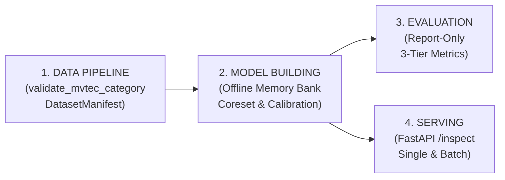

# Industrial Visual Anomaly Detection (PatchCore-Style MVTec AD)

[](https://www.python.org/)
[](https://pytorch.org/)
[](https://fastapi.tiangolo.com/)
[](tests/)
[](LICENSE)

An enterprise-grade, One-Class Visual Anomaly Detection system for industrial automated surface inspection. Built using a **PatchCore-style** architecture with frozen multi-layer CNN backbones (ResNet18), greedy k-center coreset subsampling, empirical normal calibration, 3-tier evaluation, and a low-latency serving engine.

---

## 1. Problem Statement

Industrial quality control requires automated visual inspection capable of detecting anomalous surface defects (scratches, dents, cracks, structural misalignments) on factory conveyor lines. Because defective parts are rare (< 0.1%) and structurally unpredictable:
- **Supervised classification cannot be deployed** due to extreme class imbalance and missing defect labels.
- **One-Class Anomaly Detection** is required: the system constructs a memory bank of nominal visual patches from normal parts and flags any query patch deviating significantly from this manifold.

---

## 2. System Architecture

The codebase enforces strict separation between 4 canonical pipelines:



* **Training creates frozen artifacts** (`models/<category>/config.json`, `memory_bank.npy`, `split_manifest.json`).
* **Inference and Evaluation only read artifacts** (zero model mutation).
* **Serving API delegates all ML math to the detector**.
* **Strict Category Isolation**: `ModelRegistry` rejects cross-category fallback (requesting `cable` will never fall back to `bottle`).

---

## 3. Data Flow

```
Input Image [Batch, 3, 224, 224]
       ↓
Frozen Backbone Forward (ResNet18: layer2 [128D, 28x28] + layer3 [256D, 14x14 upsampled])
       ↓
Dense Patch Embeddings [Batch * 784, 384D]
       ↓
Nearest-Neighbor Distance to Memory Bank [K=1000, 384D]
       ↓
Raw Anomaly Heatmap [28, 28] → Gaussian Smoothing (sigma=1.0)
       ↓
Image Anomaly Score (99th Percentile) & Surface Defect Ratio
       ↓
Operational Decision Engine (ThresholdPolicy: PASS / REVIEW / FAIL)
```

For complete mathematical derivations and tensor lifecycle, see **[docs/DATA_FLOW.md](docs/DATA_FLOW.md)**.

---

## 4. Offline Model Building Pipeline

> [!NOTE]
> **Nature of "Training"**: This system does **not** perform gradient descent, backpropagation, or loss optimization. It is an **offline representation learning and memory bank construction** process.

1. **Held-out Split**: Normal images are split 80% / 20% into a Memory Set ($N_{\text{mem}}$) and a Calibration Set ($N_{\text{cal}}$). The split is serialized to `split_manifest.json` for 100% reproducibility.
2. **Feature Extraction**: Intermediate activations from `layer2` and `layer3` of a frozen ImageNet-pretrained CNN are aligned via bilinear interpolation and concatenated into 384D vectors.
3. **Greedy K-Center Coreset**: Full memory patches (~130,000 vectors) are projected into a 64D space via Johnson-Lindenstrauss random projection for selection speedup. The minimax center algorithm selects 1,000 representative indices. The **original 384D vectors** at these indices form the runtime `MemoryBank`.
4. **Held-Out Normal Calibration**: Anomaly scores on the 20% held-out normal images determine the operating threshold policy without touching defect samples.

---

## 5. Anti-Leakage & Operational Policy

### Anti-Leakage Policy
* **Zero Defect Leakage**: Offline model building only reads `train/good/`. Defect test images and ground-truth masks are never touched during training. Enforced by unit test `test_training_never_reads_test_directory()`.
* **Report-Only Evaluation**: Evaluation loads the frozen artifact and calculates performance. It is strictly forbidden from tuning or modifying thresholds on the test set.

### Operating Threshold Policy
* `review_threshold` = **P95** of held-out normal image scores.
* `fail_threshold` = **P99** of held-out normal image scores.
* `pixel_threshold` = **P99** across all normal heatmap pixels.

> [!IMPORTANT]
> P95 / P99 are operational buffer policies calibrated on normal distributions, **not** defect-optimal thresholds. In production, thresholds are adjusted based on factory scrap costs (FRR) vs customer defect escape risk (FAR).

---

## 6. Benchmark Results & Ablation Summary

Evaluated on the official MVTec AD test split using ResNet18 (`layer2` + `layer3`, 1,000 coreset patches):

| Category | Test Samples | Image AUROC | Image AP | Pixel AUROC | Pixel AP | AUPRO@0.3 | Accuracy | Defect Recall | Specificity | F1 Score |
| :--- | :---: | :---: | :---: | :---: | :---: | :---: | :---: | :---: | :---: | :---: |
| **bottle** | 83 | **1.0000** | **1.0000** | **0.9818** | **0.7157** | **0.9410** | **1.0000** | **1.0000** | **1.0000** | **1.0000** |

### Inference Latency & Throughput (Intel/AMD CPU, Category: `bottle`)

| Mode | Batch Size | Latency / Batch | Latency / Image | Throughput | Memory Footprint |
| :--- | :---: | :---: | :---: | :---: | :---: |
| Single Image | 1 | 145.7 ms | 145.7 ms | 6.86 FPS | 1.46 MB (RAM / Disk) |
| Batched | 4 | 417.1 ms | 104.3 ms | 9.59 FPS | 1.46 MB |
| Batched | 8 | 842.5 ms | 105.3 ms | 9.50 FPS | 1.46 MB |

For full ablation studies on coreset fraction (1%–100%) and layer combinations, see **[docs/MODEL.md](docs/MODEL.md)**.

---

## 7. How to Run

### Setup Environment
```bash
python -m venv venv
# Windows: venv\Scripts\activate | Linux/macOS: source venv/bin/activate
pip install -r requirements.txt
```

### Download Dataset
```bash
# Download bottle category (default)
python scripts/download_data.py --category bottle

# Or download all 15 MVTec AD categories
python scripts/download_data.py --category all
```

### Master Pipeline CLI
```bash
# 1. Validate data integrity and generate manifest
python -m src.pipeline data --category bottle

# 2. Build model artifact and calibrate thresholds
python -m src.pipeline train --category bottle --backbone resnet18

# 3. Evaluate model (3-tier report-only)
python -m src.pipeline evaluate --category bottle

# 4. Start REST API server
python -m src.pipeline serve --port 8000
```

### Run Benchmarks
```bash
# Measure CPU/GPU latency, throughput, and memory footprint
python scripts/benchmark_inference.py --category bottle

# Run end-to-end benchmark across all available categories
python scripts/run_all_categories.py
```

### Run Automated Tests (40 Tests)
```bash
pytest -v
```

---

## 8. Repository Structure

```
Mvtec-Anomaly-Detection/
├── configs/                       # Configuration overrides
├── data/
│   └── raw/                       # Downloaded MVTec AD datasets
├── docs/                          # Comprehensive technical documentation
│   ├── ARCHITECTURE.md            # 4-Pipeline architecture & design principles
│   ├── DATA_FLOW.md               # Tensor lifecycles & data transformations
│   └── MODEL.md                   # Modeling rationale, PatchCore, & ablations
├── models/                        # Category-scoped model artifacts
│   └── bottle/
│       ├── config.json            # ModelArtifact metadata & ThresholdPolicy
│       ├── memory_bank.npy        # Compact coreset patch embeddings (1000x384)
│       └── split_manifest.json    # Reproducible memory vs calibration split
├── reports/                       # Generated evaluation reports
│   ├── bottle/test_metrics.json   # 3-tier metrics JSON
│   └── benchmark.csv              # Aggregated multi-category benchmark table
├── scripts/
│   ├── benchmark_inference.py     # Latency & throughput benchmarking
│   ├── download_data.py           # Multi-category dataset downloader
│   ├── generate_visual_samples.py # Heatmap visualization generator
│   └── run_all_categories.py      # Multi-category training & evaluation runner
├── src/
│   ├── config.py                  # TrainConfig & PreprocessingConfig
│   ├── pipeline.py                # Master 4-pipeline orchestrator
│   ├── api/                       # Serving transport layer (FastAPI)
│   │   ├── app.py                 # REST endpoints (/health, /models, /inspect)
│   │   └── schemas.py             # Pydantic request/response data contracts
│   ├── data/                      # Data pipeline & validation
│   │   ├── dataset.py             # ImageFolderDataset
│   │   ├── transforms.py          # Preprocessing & normalization pipeline
│   │   └── validation.py          # DatasetManifest & integrity validation
│   ├── evaluation/                # Evaluation pipeline (Report-Only)
│   │   ├── aupro.py               # Area Under Per-Region Overlap (AUPRO@0.3)
│   │   ├── evaluator.py           # 3-tier evaluation engine
│   │   └── metrics.py             # Detection, localization, operational metrics
│   ├── inference/                 # Serving inference engine
│   │   ├── decision.py            # Operational QC decision & severity logic
│   │   ├── detector.py            # AnomalyDetector & inspect_batch()
│   │   ├── localization.py        # Heatmap smoothing & overlay blending
│   │   └── scoring.py             # Nearest-neighbor scoring & percentile logic
│   ├── model/                     # Core representations & persistence
│   │   ├── artifacts.py           # ModelArtifact, ThresholdPolicy, SplitManifest
│   │   ├── coreset.py             # Johnson-Lindenstrauss + Greedy K-Center
│   │   ├── feature_extractor.py   # Configurable multi-layer backbone
│   │   ├── memory_bank.py         # MemoryBank 1-NN index
│   │   └── registry.py            # Strict category resolution & caching
│   └── training/                  # Offline model building
│       ├── calibration.py         # Held-out normal empirical calibration
│       └── trainer.py             # Offline model building orchestrator
└── tests/                         # 3-Tier Test Suite (40 tests)
    ├── api/                       # API endpoint integration tests
    ├── integration/               # Multi-component & batch inference tests
    ├── regression/                # Determinism & reference score tests
    └── unit/                      # Unit tests (leakage, consistency, coreset, etc.)
```

---

## 9. REST API Specification

### `POST /inspect` (Single Image)
```bash
curl -X POST "http://localhost:8000/inspect?category=bottle" \
     -F "file=@data/raw/bottle/test/broken_large/000.png"
```

**Response (Status 200 OK)**:
```json
{
  "inspection_id": "insp_9a4f21b7e801",
  "category": "bottle",
  "decision": "FAIL",
  "severity": "FAIL_MAJOR",
  "scores": {
    "anomaly_score": 4.1205,
    "review_threshold": 2.6130,
    "fail_threshold": 2.8442
  },
  "localization": {
    "anomalous_area_ratio": 0.0892,
    "peak_score": 5.2104,
    "pixel_threshold": 2.5079
  },
  "model": {
    "version": "1.0.0",
    "category": "bottle"
  },
  "overlay_b64": "data:image/png;base64,iVBORw0KGgoAAA..."
}
```

### `POST /inspect/batch` (High-Throughput Batch)
```bash
curl -X POST "http://localhost:8000/inspect/batch?category=bottle" \
     -F "files=@img1.png" \
     -F "files=@img2.png"
```

---

## 10. Engineering Limitations & Real-World Considerations

1. **Rigid vs. Non-Rigid Variations**: PatchCore relies on spatial feature consistency. It performs best on rigid industrial components (bottles, transistors, screws, metal nuts). For non-rigid, deformable textures (e.g. crumpled fabrics), spatial neighborhood variations increase false alarms.
2. **Camera Lighting Alignment**: Changes in factory camera angles or ambient illumination shift intermediate CNN feature maps. Normalizing illumination in preprocessing is recommended.
3. **Threshold Recalibration**: Operating thresholds (P95/P99) reflect nominal training distributions. Production lines must recalibrate thresholds based on historical defect escape tolerances and economic scrap cost trade-offs.
