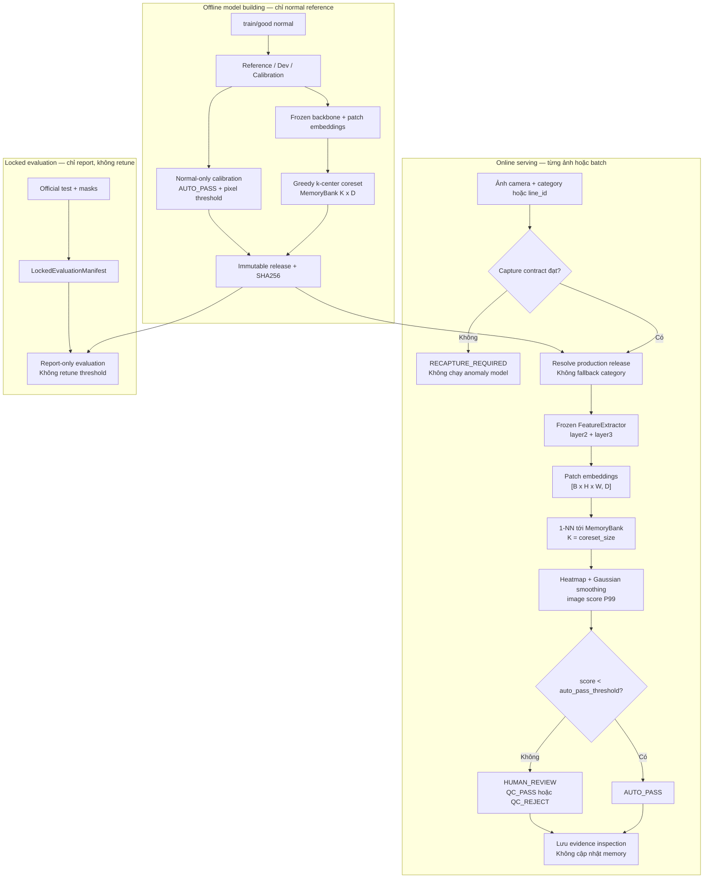

# Industrial Visual Anomaly Detection — PatchCore-style MVTec AD

[](https://www.python.org/)
[](https://pytorch.org/)
[](https://pytorch.org/vision/stable/)
[](https://fastapi.tiangolo.com/)
[](https://numpy.org/)
[](https://scikit-learn.org/)
[](https://scipy.org/)
[](https://python-pillow.org/)
[](https://matplotlib.org/)
[](https://huggingface.co/docs/huggingface_hub/)
[](https://pytest.org/)
[](LICENSE)

Hệ thống phát hiện bất thường ảnh công nghiệp theo hướng **one-class**, dùng ảnh normal để xây dựng memory bank và chuyển ảnh nghi ngờ sang human QC. V1 có ba trạng thái kỹ thuật: `RECAPTURE_REQUIRED`, `AUTO_PASS`, `HUMAN_REVIEW`; quyết định chất lượng cuối cùng là `QC_PASS` hoặc `QC_REJECT` do con người ghi nhận.

> Đây là implementation **PatchCore-style**, không tuyên bố tái hiện nguyên bản 100% paper PatchCore. Code hiện tại dùng frozen CNN backbone, multi-layer patch embedding, coreset, nearest-neighbor scoring và normal-only calibration.

---

## 1. Bài toán và phạm vi ứng dụng

MVTec AD cung cấp ảnh `train/good` normal và official test có defect/mask. Vì vậy one-class anomaly detection là formulation tự nhiên cho repo này: model học phân bố hình ảnh đạt chuẩn, sau đó đo độ lệch của ảnh mới.

Phạm vi V1:

- Một category/SKU tại mỗi production line.
- Training chỉ đọc `train/good`; test và mask chỉ được mở ở locked evaluation.
- Không tự động kết luận `FAIL_MINOR`/`FAIL_MAJOR`; ảnh vượt ngưỡng đi tới `HUMAN_REVIEW`.
- Không tự động đưa ảnh production vào memory bank.
- Không suy ra factory throughput từ prevalence của MVTec AD.

Supervised learning vẫn có thể phù hợp nếu nhà máy có đủ defect labels ổn định; repo này không dùng supervised classification vì dữ liệu mục tiêu được thiết kế theo normal-only.

---

## 2. Kiến trúc và luồng logic duy nhất

Mermaid dưới đây là contract cấp cao chi phối code, config, artifact, API và report:



### Bốn pipeline chính

1. **Data**: `validate_reference_category()` chỉ đọc `train/good`; `validate_locked_evaluation()` chỉ đọc `test` và `ground_truth`.
2. **Model building**: frozen backbone → patch embedding → coreset memory bank → calibration → release bất biến.
3. **Evaluation**: dùng release đã freeze và `LockedEvaluationManifest`, ghi report; không chọn model/ngưỡng trên official test.
4. **Serving**: API kiểm tra input và định tuyến category/line; `AnomalyDetector` thực hiện quality gate, scoring và response.

`production.json` là pointer mutable duy nhất; thư mục `models/releases/` không bị overwrite. `ModelRegistry` không chọn category đầu tiên khi request thiếu mapping. Batch serving chạy quality gate từng ảnh, chỉ stack ảnh hợp lệ, sau đó ghép kết quả lại theo đúng thứ tự input.

### Verified benchmark snapshot — chỉ category `bottle`

Đây là kết quả đã đo trên official MVTec AD test của **category `bottle` chỉ**; không diễn giải cho toàn bộ 15 category.

| Metric | Result |
| --- | :---: |
| Image AUROC | **1.0000** |
| Image AP | **1.0000** |
| Pixel AUROC | **0.9818** |
| Pixel AP | **0.7157** |
| AUPRO@0.3 | **0.9410** |
| CPU latency | **145.7 ms/image** |

Chi tiết mẫu số, operational metrics, provenance và giới hạn benchmark nằm ở [Section 6](#6-benchmark-đã-đo--chỉ-category-bottle).

---

## 3. Luồng data và tensor

| Giai đoạn | Dữ liệu chính | Nơi thực hiện |
| --- | --- | --- |
| Input | PIL RGB, contract width/height/exposure/blur/ROI | `src/capture/` |
| Preprocess | Resize mặc định `224x224`, ToTensor, ImageNet normalize | `src/data/transforms.py` |
| Backbone | Frozen ResNet18 `layer2=[128,28,28]`, `layer3=[256,14,14]` | `src/model/feature_extractor.py` |
| Embedding | Upsample layer3, concat → `[B*784,384]` | `src/model/feature_extractor.py` |
| Memory | Greedy k-center trên projection 64D, lưu vector gốc 384D | `src/model/coreset.py` |
| Score | 1-NN Euclidean → heatmap `[28,28]` → smoothing → percentile score | `src/inference/` |
| Decision | `AUTO_PASS` nếu score `< auto_pass_threshold`, còn lại `HUMAN_REVIEW` | `src/inference/decision.py` |

Chi tiết tensor và công thức nằm trong **[docs/DATA_FLOW.md](docs/DATA_FLOW.md)**.

---

## 4. Quy trình kỹ thuật build model

Đây không phải supervised training: không backpropagation, không loss optimization. `train_patchcore()` thực hiện forward qua backbone frozen, tạo memory bank, calibration và ghi release.

1. `validate_reference_category()` chỉ lấy `data/raw/<category>/train/good`.
2. `split_reference_dev_calibration()` tách ba tập không chồng lấn bằng seed:
   - **Reference**: dùng tạo patch memory.
   - **Dev**: dùng ablation và synthetic stress, không dùng official test.
   - **Calibration**: chỉ dùng khóa `auto_pass_threshold` và `pixel_threshold`.
3. `FeatureExtractor` lấy layer2/layer3, căn chỉnh không gian và tạo vector 384 chiều.
4. `select_coreset_indices()` chọn đúng `coreset_size` bằng greedy k-center trên projection 64 chiều; vector lưu runtime vẫn là 384 chiều.
5. Calibration tính P99 normal-only. Đây là heuristic upper-tail, không phải cam kết FRR production là 1%.
6. Trainer ghi `models/releases/<category>-v<model_version>/` bất biến rồi cập nhật `models/production.json`.

---

## 5. Leakage control, threshold và quyết định vận hành

### Leakage control

- Model building không gọi `validate_locked_evaluation()` và không đọc `test/` hoặc `ground_truth/`.
- Official test chỉ được đọc trong `evaluate_category()` sau khi release đã freeze.
- Ablation chỉ chạy Dev normal và synthetic corruption sinh từ Dev; không dùng test để chọn backbone/layer/coreset.
- `NormalReferenceManifest` và `LockedEvaluationManifest` tách riêng; fingerprint dùng SHA256 nội dung file.

### Threshold policy

- `auto_pass_threshold = quantile(calibration_normal_scores, 0.99)`.
- `pixel_threshold = quantile(all_calibration_normal_heatmap_pixels, 0.99)`.
- `score < auto_pass_threshold` → `AUTO_PASS`.
- `score >= auto_pass_threshold` → `HUMAN_REVIEW`.
- Capture không đạt contract → `RECAPTURE_REQUIRED`, không chạy model.

> [!IMPORTANT]
> `AUTO_PASS` chỉ là triage kỹ thuật. QC phải ghi `QC_PASS`/`QC_REJECT`; anomaly extent và peak score không được diễn giải thành major/minor.

---

## 6. Benchmark đã đo — chỉ category `bottle`

Verified result hiện có trong repo là **MVTec AD official test của category `bottle` chỉ** với ResNet18, layer2 + layer3 và memory bank 1,000 patch. Không diễn giải bảng này cho cả 15 category.

Các giá trị được làm tròn từ [reports/bottle/test_metrics.json](reports/bottle/test_metrics.json). Đây là report benchmark lịch sử; sau khi tạo release V1 mới, hãy chạy locked evaluation để ghi lại `release_id` và fingerprint tương ứng.

| Metric | Result |
| :--- | :---: |
| Image AUROC | **1.0000** |
| Image AP | **1.0000** |
| Pixel AUROC | **0.9818** |
| Pixel AP | **0.7157** |
| AUPRO@0.3 | **0.9410** |
| Test samples | 83 = 20 normal + 63 defect |

### Operational metrics tại boundary AUTO_PASS

Từ counts của report `bottle` hiện có: 17 normal được AUTO_PASS, 3 normal chuyển review, 63 defect không lọt qua AUTO_PASS. Khi chuyển semantics V1, legacy `auto_fail` được gộp vào `HUMAN_REVIEW`.

| Metric | Result |
| :--- | :---: |
| AUTO_PASS coverage | 17/83 = **20.48%** |
| Normal AUTO_PASS rate | 17/20 = **85.00%** |
| False-pass rate on defects | 0/63 = **0.00%** |
| HUMAN_REVIEW rate | 66/83 = **79.52%** |
| False-review rate on normal | 3/20 = **15.00%** |

Đây là số liệu benchmark đã lưu, không thay thế việc chạy lại locked evaluation sau khi đổi model. Report mới sẽ thêm `release_id`, dataset fingerprint, defect-type slices và annotated-area slices.

### Inference latency

Result đã ghi nhận: **145.7 ms/image** cho single-image inference trên category `bottle`. Artifact cũ không lưu CPU model, RAM, PyTorch version hoặc số thread, nên README không gán kết quả này cho một model CPU cụ thể.

Muốn có benchmark có thể tái lập, chạy `scripts/benchmark_inference.py`; script in và trả về CPU, PyTorch, số thread, image size, latency, throughput, RSS và memory-bank footprint.

Các ablation chỉ chạy trên Dev normal + synthetic stress. Xem **[docs/MODEL.md](docs/MODEL.md)**.

---

## 7. Cài đặt và chạy

### 7.1. Điều kiện môi trường

- Python `3.10+`.
- PyTorch và torchvision tương thích với phần cứng; `requirements.txt` đang khóa phiên bản dùng để kiểm thử repo.
- Dataset MVTec AD được đặt tại `data/raw/<category>`.
- CPU vẫn chạy được; GPU chỉ là tùy chọn.

Tạo môi trường ảo và cài dependency:

```bash
python -m venv .venv

# Windows PowerShell
.\.venv\Scripts\Activate.ps1

# Linux/macOS
# source .venv/bin/activate

python -m pip install --upgrade pip
python -m pip install -r requirements.txt
```

### 7.2. Tải và kiểm tra dữ liệu

```bash
# Chỉ tải category dùng để kiểm tra nhanh
python scripts/download_data.py --category bottle

# Hoặc tải toàn bộ category MVTec AD
python scripts/download_data.py --category all

# Kiểm tra train/good, test, ground_truth và ghi manifest reference
python -m src.pipeline data --category bottle
```

Script tải dữ liệu ghi `data/raw/DATASET_SOURCE.json`. Không đưa `test/` hoặc `ground_truth/` vào bước build model.

### 7.3. Build release bất biến

```bash
python -m src.pipeline train \
  --category bottle \
  --backbone resnet18 \
  --model-version 1.0.0
```

Lệnh trên tạo release tại `models/releases/bottle-v1.0.0/`, tạo/cập nhật pointer `models/production.json` và giữ alias tương thích tại `models/bottle/`. Không dùng lại một `model_version` để ghi đè release đã tồn tại.

Khi cần truyền các tham số train đầy đủ, dùng CLI cấu hình trực tiếp:

```bash
python -m src.train \
  --category bottle \
  --backbone resnet18 \
  --coreset-size 1000 \
  --model-version 1.0.1
```

### 7.4. Đánh giá locked test

```bash
# Report-only: ghi ra file mới, không ghi đè report lịch sử
python -m src.pipeline evaluate \
  --category bottle \
  --output-report reports/bottle/test_metrics_v1.json

# Tương đương, có thể chỉ định file report
python -m src.evaluate \
  --category bottle \
  --output-report reports/bottle/test_metrics_v1.json
```

Report đã tồn tại không bị ghi đè mặc định. Chỉ dùng cờ dưới đây khi đang kiểm tra lại một evaluation run có chủ đích:

```bash
python -m src.pipeline evaluate \
  --category bottle \
  --reopen-locked-test
```

### 7.5. Chạy API

```bash
python -m src.pipeline serve --host 0.0.0.0 --port 8000
```

Sau đó mở `http://localhost:8000/docs` để xem OpenAPI. API không tự chọn category đầu tiên: request phải truyền `category` hoặc `line_id` đã được map trong production registry.

### 7.6. Benchmark, ablation và test

```bash
# Benchmark có metadata runtime: CPU, PyTorch, thread, kích thước ảnh, latency
python scripts/benchmark_inference.py --category bottle --runs 30

# Ablation chỉ dùng Dev normal và synthetic stress, không dùng official test
python scripts/run_ablations.py --category bottle --experiment all

# Chạy toàn bộ category đã tải và ghi summary
python scripts/run_all_categories.py --model-version 1.0.0

# Chỉ thêm cờ này khi chủ động ghi lại report đã tồn tại
# python scripts/run_all_categories.py --model-version 1.0.0 --reopen-locked-test

# Test
pytest -q
```

`pytest` cần PyTorch/torchvision theo `requirements.txt`; nếu runtime hiện tại chưa có hai package này thì test ML/API không thể collection đầy đủ.

### 7.7. Shortcut qua Makefile

Nếu môi trường có `make`, các lệnh tương ứng là:

```bash
make setup       # Cài requirements.txt
make download    # Tải category mặc định
make train       # Build release bottle
make evaluate    # Ghi report runtime riêng, không ghi đè benchmark lịch sử
make test        # Chạy pytest -q
```

`make evaluate` ghi vào `reports/bottle/test_metrics_make.json`; report đã tồn tại
vẫn được bảo vệ giống CLI và cần xóa/chọn đường dẫn mới nếu muốn chạy lại.

---

## 8. Cấu trúc thư mục dự án

```text
Mvtec-Anomaly-Detection/
├── .dockerignore                   # Loại trừ dataset/artifact khi build image
├── .env.example                    # Biến môi trường mẫu, không chứa secret
├── .github/                        # Workflow CI nếu được bật
├── data/
│   ├── raw/                        # MVTec AD và DATASET_SOURCE.json
│   └── processed/                  # Dữ liệu trung gian tùy pipeline
├── docs/
│   ├── ARCHITECTURE.md             # Ranh giới 4 pipeline và nguyên tắc thiết kế
│   ├── DATA_FLOW.md                # Tensor, manifest và data lineage
│   └── MODEL.md                    # PatchCore-style, calibration và ablation
├── models/
│   ├── releases/<category>-v<version>/
│   │   ├── memory_bank.npy         # Coreset patch embeddings
│   │   ├── reference_manifest.json # Fingerprint dữ liệu normal đã dùng
│   │   ├── split_manifest.json     # Reference/Dev/Calibration split
│   │   └── manifest.json            # SHA256 integrity của artifact
│   ├── <category>/                  # Alias tương thích với layout cũ
│   └── production.json              # Pointer category/line -> release
├── reports/
│   ├── <category>/                 # Report evaluation và slices
│   └── sample_outputs/             # Heatmap/overlay sinh từ script
├── scripts/
│   ├── benchmark_inference.py      # Latency, throughput và runtime metadata
│   ├── download_data.py            # Tải category và ghi nguồn dữ liệu
│   ├── generate_visual_samples.py # Sinh ảnh original/mask/heatmap/overlay
│   ├── run_ablations.py            # Ablation leakage-safe trên Dev
│   └── run_all_categories.py       # Chạy nhiều category tuần tự
├── src/
│   ├── capture/                    # Capture contract và quality gate
│   ├── api/                        # FastAPI transport và Pydantic schemas
│   ├── data/                       # Dataset, transform, manifest, validation
│   ├── evaluation/                 # Locked report-only metrics và AUPRO
│   ├── inference/                  # Scoring, localization, decision, detector
│   ├── model/                      # Backbone, coreset, artifact, registry
│   ├── storage/                    # SQLite inspection/review lifecycle
│   ├── training/                   # Split, calibration và trainer offline
│   ├── path_safety.py              # Chặn category/release path traversal
│   ├── config.py                   # TrainConfig/PreprocessingConfig
│   ├── evaluate.py                 # CLI locked evaluation
│   ├── pipeline.py                 # Orchestrator data/train/evaluate/serve
│   └── train.py                    # CLI build model release
├── tests/
│   ├── api/                        # Contract và endpoint tests
│   ├── integration/                # Detector, batch và artifact lifecycle
│   ├── regression/                 # Determinism và score regression
│   └── unit/                       # Logic, leakage, config, coreset, metrics
├── Makefile                         # Shortcut setup/download/train/evaluate/test
├── Dockerfile                        # Image chạy API nếu cần container hóa
├── LICENSE                           # MIT license
├── .gitignore                        # Loại trừ dataset, cache và artifact runtime
├── pytest.ini                       # Cấu hình pytest tối thiểu, không sinh temp trong repo
├── requirements.txt                 # Dependency versions
└── README.md                        # Tài liệu vận hành chính
```

Các thư mục runtime như `data/raw`, `models/releases` và `reports` có thể chưa tồn tại trong clone sạch. Chúng chỉ được tạo khi chạy download, train hoặc evaluate; không commit dataset và checkpoint lớn vào source tree.

---

## 9. REST API và vòng đời inspection

### 9.1. Single image

```bash
curl -X POST "http://localhost:8000/inspect?category=bottle" \
  -F "file=@data/raw/bottle/test/broken_large/000.png" \
  -F "include_overlay=true"
```

Có thể thay `category=bottle` bằng `line_id=<line đã đăng ký>`. Nếu truyền cả hai, server kiểm tra chúng phải map tới cùng category. Thiếu cả hai trả lỗi `422`; category không tồn tại trả `404`; không có fallback sang category đầu tiên.

Response V1 có dạng:

```json
{
  "inspection_id": "insp_9a4f21b7e801",
  "category": "bottle",
  "decision": "HUMAN_REVIEW",
  "severity": null,
  "scores": {
    "anomaly_score": 4.1205,
    "auto_pass_threshold": 2.8442
  },
  "localization": {
    "anomalous_area_ratio": 0.0892,
    "peak_anomaly_score": 5.2104,
    "pixel_threshold": 1.75
  },
  "capture_quality": {
    "passed": true,
    "reason": "ok"
  },
  "model": {
    "version": "1.0.0",
    "category": "bottle",
    "release_id": "bottle-v1.0.0"
  },
  "line_id": null,
  "camera_id": null,
  "timestamp": "2026-09-08T00:00:00+00:00",
  "overlay_b64": "data:image/png;base64,iVBORw0KGgoAAA..."
}
```

Ý nghĩa quyết định:

- `RECAPTURE_REQUIRED`: ảnh không đạt capture contract; không chạy anomaly scoring.
- `AUTO_PASS`: ảnh đạt quality và image score thấp hơn `auto_pass_threshold`.
- `HUMAN_REVIEW`: ảnh đạt quality nhưng cần QC người xác nhận `QC_PASS` hoặc `QC_REJECT`.

`severity` được giữ để tương thích client cũ và luôn là `null` trong policy V1. `anomalous_area_ratio` và `peak_anomaly_score` là evidence kỹ thuật, không phải nhãn `major/minor`.

### 9.2. Batch image

```bash
curl -X POST "http://localhost:8000/inspect/batch?category=bottle" \
  -F "files=@img1.png" \
  -F "files=@img2.png"
```

Batch giới hạn tối đa 16 file; overlay mặc định tắt để giảm payload. Các route hỗ trợ vận hành gồm `GET /health`, `GET /health/live`, `GET /health/ready`, `GET /models` và `GET /models/{category}`.

---

## 10. PatchCore-style và khác biệt với PatchCore gốc

### Thành phần lấy cảm hứng từ PatchCore

- frozen pretrained CNN backbone;
- patch embeddings từ nhiều layer trung gian;
- memory bank của patch normal;
- coreset selection để giảm chi phí lưu trữ và tìm kiếm;
- nearest-neighbor distance làm anomaly score;
- heatmap từ patch score để định vị vùng bất thường.

### Khác biệt có chủ đích của repo này

- dùng ResNet18 `layer2 + layer3`, embedding 384 chiều và projection 64 chiều cho greedy k-center;
- tách Reference/Dev/Calibration để kiểm soát leakage và khóa threshold normal-only;
- có capture contract trước model inference và trạng thái `RECAPTURE_REQUIRED`;
- release immutable, SHA256 integrity và production pointer theo category/line;
- policy V1 chỉ có `AUTO_PASS`/`HUMAN_REVIEW`, sau đó human QC ghi `QC_PASS`/`QC_REJECT`;
- lưu inspection/review lifecycle trong SQLite và không tự động cập nhật memory bank từ ảnh production.

Vì các khác biệt này, kết quả nên được gọi là **PatchCore-style implementation**, không phải reproduction nguyên bản 100% của paper.

## 11. Visual outputs

Các ảnh dưới đây là artifact thật đã có trong repository. Mỗi ảnh là composite gồm input, ground-truth mask, heatmap và localization overlay; chúng được tạo bởi `scripts/generate_visual_samples.py`.


Repo hiện lưu hai composite sample tương ứng với defect và normal; mỗi composite đã có đủ bốn panel `Input | Ground Truth | Heatmap | Overlay`. Script chọn defect type đầu tiên của category và không tạo ảnh minh họa giả hoặc ghi nhãn benchmark cho category chưa được chạy. Sau khi đã train release và đặt dataset đúng vị trí, chạy:

```bash
python scripts/generate_visual_samples.py --category bottle
```

## 12. Định nghĩa metrics

| Nhóm | Metric | Ý nghĩa |
| --- | --- | --- |
| Detection | Image AUROC | Khả năng xếp hạng normal/defect ở cấp ảnh |
| Detection | Image AP | Average precision, phụ thuộc prevalence của tập đánh giá |
| Localization | Pixel AUROC | Khả năng xếp hạng pixel bất thường |
| Localization | Pixel AP | Độ chính xác vùng defect khi pixel dương ít |
| Localization | AUPRO@0.3 | Region overlap theo giới hạn false-positive-area 0.3 |
| Operations | AUTO_PASS coverage | Tỷ lệ ảnh được thông qua tự động trên toàn tập |
| Operations | False-pass rate | Tỷ lệ defect bị cho `AUTO_PASS` |
| Operations | HUMAN_REVIEW rate | Tỷ lệ ảnh đi vào hàng đợi QC |
| Operations | False-review rate on normal | Tỷ lệ ảnh normal bị đưa vào QC |

Các operational metrics cần báo cáo cùng mẫu số `normal/defect`, vì coverage và false-review thay đổi theo prevalence. Bảng benchmark ở Section 6 chỉ là kết quả đã lưu cho `bottle`, không đại diện cho 15 category.

## 13. Giới hạn và khả năng tái lập

1. Benchmark cũ [reports/bottle/test_metrics.json](reports/bottle/test_metrics.json) có các metric tốt nhưng chưa lưu đầy đủ CPU model, RAM, PyTorch version và số thread. Vì vậy README chỉ ghi latency 145.7 ms/image, không gán cho một hardware cụ thể. Dùng `scripts/benchmark_inference.py` để tạo benchmark runtime đầy đủ.
2. MVTec AD là benchmark nghiên cứu; prevalence và điều kiện chụp không đại diện trực tiếp cho một dây chuyền nhà máy.
3. Thay đổi camera, ánh sáng, ROI, kích thước vật thể hoặc phân bố normal có thể làm thay đổi feature distribution và threshold.
4. P99 calibration là heuristic upper-tail trên normal holdout, không phải cam kết production false-reject rate cố định.
5. Cấu hình không tự động cập nhật memory bank từ dữ liệu production. Muốn đổi model phải build version mới, đánh giá locked report và cập nhật production pointer có chủ đích.
6. Với vật thể biến dạng hoặc texture không ổn định, spatial feature consistency yếu hơn và có thể tăng false review; cần kiểm tra Dev/Calibration riêng cho từng category.

## 14. License

MIT. Xem [LICENSE](LICENSE).
