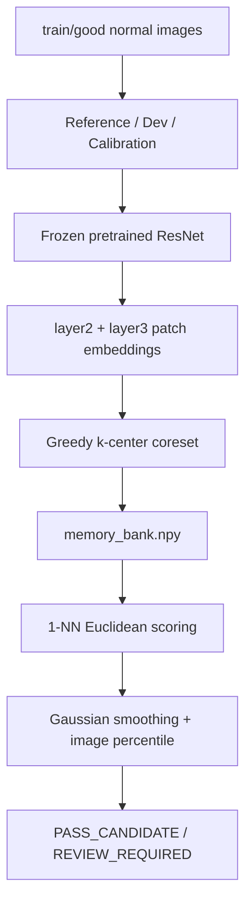

# Kiến trúc

Repo tập trung vào một sản phẩm CV duy nhất: PatchCore-style visual anomaly
detection trên MVTec AD. FastAPI, SQLite và Docker chỉ hỗ trợ demo và vận hành
local; chúng không thay thế pipeline anomaly detection.

## Pipeline chính



## Training

`train_patchcore()` nhận `NormalReferenceManifest` hoặc manifest đầy đủ nhưng
chỉ sử dụng `train/good`. Nó trích feature bằng backbone frozen, chọn coreset,
đo score trên Calibration normal và ghi:

```text
models/<category>/memory_bank.npy
models/<category>/metadata.json
reports/<category>/training_split.json
reports/<category>/reference_manifest.json
```

Model directory chỉ chứa các file cần thiết để detector chạy.

## Inference

`AnomalyDetector` nhận trực tiếp một model category. Input check được chạy trước
feature extraction. Ảnh không hợp lệ trả `RECAPTURE_REQUIRED`; ảnh hợp lệ được
so với memory bank bằng 1-NN, reshape thành heatmap, Gaussian smoothing rồi
tính image score. Score dưới image threshold là `PASS_CANDIDATE`, còn lại là
`REVIEW_REQUIRED`.

Detector không tự cập nhật memory bank. Kết quả QC nếu được lưu chỉ là feedback
độc lập cho người dùng.

## Evaluation

Official test và mask chỉ được đọc tại `evaluation/evaluator.py`. Evaluation dùng
threshold đã lưu, không gọi lại calibration và ghi detection, localization,
operational metrics cùng defect/area slices.
