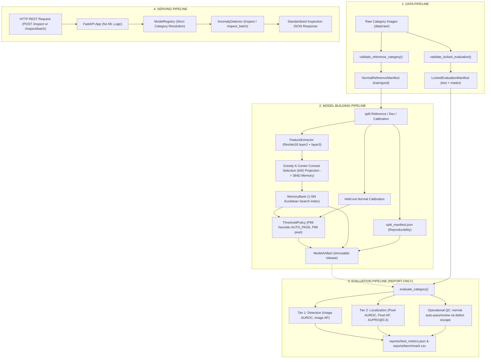

# System Architecture: Industrial Visual Anomaly Detection

## 1. Overview & Architectural Philosophy

This repository implements a production-grade, One-Class Visual Anomaly Detection system inspired by the PatchCore framework (Roth et al., CVPR 2022). It is designed to inspect industrial components on manufacturing assembly lines, detecting surface flaws without requiring prior defect labels during training.

### Core Architectural Principles

1. **Explicit Pipeline Boundaries**: The codebase is strictly organized into 4 decoupled canonical pipelines: Data, Model Building, Evaluation, and Serving.
2. **Artifact-Centric Lifecycle**:
   - Training produces a self-contained, immutable artifact bundle under `models/releases/<category>-v<version>/` and updates `models/production.json`.
   - Inference and Evaluation strictly consume frozen artifacts.
   - The REST API is a lightweight HTTP transport layer with zero embedded ML math.
3. **Strict Category Isolation**: Models are strictly partitioned by category. The `ModelRegistry` rejects cross-category fallback (e.g., requesting `cable` will never fall back to `bottle`).
4. **Anti-Leakage & Operational Calibration**: `NormalReferenceManifest` chỉ chứa train/good; `LockedEvaluationManifest` chỉ được đọc ở final evaluation. Policy V1 chỉ có normal-only AUTO_PASS và HUMAN_REVIEW.

---

## 2. The 4 Canonical Pipelines

---

## 3. Component Breakdown

### 3.1 Data Pipeline (`src/data/`)
- `validation.py`: Tách validator reference-only khỏi validator locked evaluation. Reference chỉ kiểm tra `train/good`; evaluation mới kiểm tra test và ground-truth mask.
- `dataset.py`: PyTorch `ImageFolderDataset` consuming paths directly from the manifest.
- `transforms.py`: Configurable `PreprocessingConfig` defining input image resolution, normalization vectors, and torchvision transformations.

### 3.2 Model Building Pipeline (`src/training/` & `src/model/`)
- `trainer.py`: Coordinates the offline model building process. Does not run gradient backpropagation; instead, runs forward feature extraction through a frozen backbone, builds the memory bank via coreset subsampling, and calibrates operating thresholds.
- `calibration.py`: Tách Reference / Dev / Calibration bằng seed cố định và tính P99 heuristic normal-only cho AUTO_PASS cùng pixel threshold.
- `artifacts.py`: Implements `ModelArtifact`, `ThresholdPolicy`, `SplitManifest`, and `ModelMetadata`.

### 3.3 Evaluation Pipeline (`src/evaluation/`)
- `evaluator.py`: **Report-Only** evaluation engine. Strictly forbidden from modifying or tuning model thresholds based on test performance.
- `metrics.py`: Evaluates performance across 3 distinct tiers: Detection, Localization, and Operational Quality Control.
- `aupro.py`: Computes Area Under the Per-Region Overlap curve (up to `max_fpr=0.3`), ensuring localized defects of varying scales are evaluated without size bias.

### 3.4 Serving Pipeline (`src/inference/` & `src/api/`)
- `detector.py`: Runtime inspection engine. Supports both single-image inspection and high-throughput batched inference (`inspect_batch`).
- `registry.py`: Resolve category hoặc line_id qua production pointer, không fallback sang category khác; thiếu mapping thì báo lỗi.
- `app.py`: FastAPI server exposing `/health`, `/health/live`, `/health/ready`, `/models`, `/inspect`, and `/inspect/batch`. Pure transport and validation layer.
- `schemas.py`: Pydantic data contracts ensuring clean API responses.
